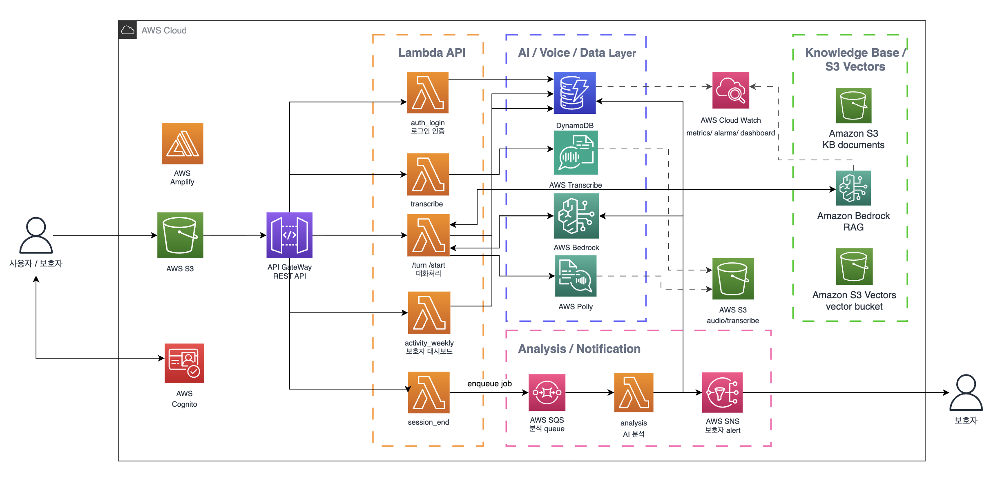

# 똑똑똑

> AWS 서버리스 기반 시니어 음성 AI 케어 플랫폼

똑똑똑은 시니어 사용자가 음성으로 일상과 감정 상태를 기록하고, 보호자가 대화/활동 신호를 확인할 수 있도록 설계한 AWS 서버리스 기반 음성 AI 케어 플랫폼입니다. 단순한 말동무 챗봇에 그치지 않고, Amazon Transcribe 기반 음성 인식, Amazon Bedrock 기반 AI 응답 생성, Amazon Polly 음성 합성, KDSQ 기반 인지 신호 기록, SQS/SNS 기반 보호자 알림까지 하나의 서버리스 흐름으로 연결했습니다.

## Tech Stack

**Frontend**


**Backend / AI**


**AWS Cloud**


## Architecture



1. 사용자는 React Native / Expo 크로스플랫폼 앱에 접속하고 서비스 로그인 또는 회원가입을 수행합니다.
2. 프론트엔드는 API Gateway REST API를 통해 인증, 세션, 대화, 음성 인식, 활동 기록 API를 호출합니다.
3. 음성 입력은 브라우저가 Transcribe Streaming WebSocket에 직접 연결하도록 Lambda가 presigned URL을 발급합니다.
4. `/turn` Lambda는 최근 대화, KDSQ 정책, 필요 시 Bedrock Knowledge Base 검색 결과를 구성해 Bedrock을 호출합니다.
5. Bedrock 응답은 Polly로 음성 합성되고, 결과 파일은 S3에 저장된 뒤 presigned URL로 반환됩니다.
6. 대화, KDSQ 응답, 자가 문진, 활동 로그는 DynamoDB 테이블에 분리 저장됩니다.
7. `/session/end`는 분석 요청을 SQS에 넣고, 분석 Lambda가 대화/KDSQ/활동 데이터를 요약해 필요 시 SNS로 보호자에게 알립니다.

## 기여 성과

### 1. 실시간 대화와 비동기 분석 분리

**Problem**

음성 대화 응답, KDSQ 기록, 세션 분석, 보호자 알림을 하나의 동기 흐름에 묶으면 사용자 응답 지연과 장애 전파 위험이 커집니다. 특히 분석/알림은 실시간 대화보다 처리 시간이 길고 실패 가능성도 달라 별도 경로가 필요했습니다.

**Solution**

API Gateway + Lambda로 대화 API를 구성하고, `/turn`은 즉시 응답 생성에 집중하도록 분리했습니다. 세션 종료 후 필요한 분석은 `/session/end`가 SQS에 작업을 넣고, 별도 analysis Lambda가 DynamoDB 데이터를 집계해 SNS 알림 여부를 판단하도록 구성했습니다.

**Result**

사용자 대화 응답 경로와 보호자 알림/분석 경로를 분리해 장애 전파 범위를 줄였습니다. 분석 작업이 지연되거나 실패해도 실시간 대화 API가 직접 영향을 받지 않는 서버리스 구조가 되었습니다.

### 2. Transcribe Streaming 직접 연결 구조

**Problem**

브라우저 음성 인식에 의존하면 OS/브라우저별 동작 차이가 크고, Lambda request-response 방식으로 실시간 오디오 스트림을 중계하면 timeout과 병목 위험이 생깁니다.

**Solution**

Lambda는 Transcribe Streaming presigned WebSocket URL만 발급하고, 브라우저가 AWS Transcribe Streaming으로 직접 음성 chunk를 전송하도록 설계했습니다. 짧은 음성 입력과 fallback 처리는 기존 Transcribe Lambda/S3 경로로 분리했습니다.

**Result**

실시간 오디오 처리를 Lambda가 직접 떠안지 않게 되어 timeout 위험을 줄였고, STT 성공/실패를 AWS 서비스 및 CloudWatch 지표 기준으로 추적할 수 있게 했습니다.

### 3. Bedrock Knowledge Base 기반 응답 방어

**Problem**

Bedrock 모델만으로 서비스 정책, KDSQ 기준, 보호자 알림 기준을 설명하면 모델이 없는 정보를 만들어낼 수 있습니다. 반대로 모든 대화에 RAG를 적용하면 정서 대화의 자연스러움이 떨어질 수 있습니다.

**Solution**

KDSQ, 자가문진, 보호자 알림, 서비스 안내처럼 사실 기반 설명이 필요한 질문에서만 Bedrock Knowledge Base를 선택적으로 조회하도록 라우팅했습니다. KB 문서는 S3 `care-guides/`에 두고, S3 Vectors 기반 Knowledge Base와 Titan embeddings 인덱스를 SAM 템플릿으로 관리했습니다.

**Result**

정확성이 필요한 구간은 KB 검색 결과를 근거로 답하도록 보강하고, 일반 정서 대화는 기존 대화 정책을 우선하도록 분리했습니다. 예약 시간, 가족 연락 여부, 실시간 정보처럼 시스템이 알 수 없는 질문은 Bedrock 호출 전 guard rule로 차단했습니다.

### 4. KDSQ 문진을 대화 흐름에 맞게 제어

**Problem**

KDSQ를 설문처럼 직접 반복하면 시니어 사용자가 검사받는 느낌을 받을 수 있고, 반대로 자유 대화만 두면 인지 변화 관찰에 필요한 신호가 누락될 수 있습니다.

**Solution**

최소 대화 턴 수, 질문 간격, 하루 질문 제한, 최근 질문 제외 조건을 두고, 기억/계산/일상 수행 같은 맥락이 드러날 때 관련 질문을 자연스럽게 연결했습니다. 가족 걱정, 짧은 대답, 감정 호소가 활성화된 경우에는 KDSQ 질문을 미루도록 서버 측 정책을 구성했습니다.

**Result**

문진이 대화를 끊지 않도록 제어하면서도, 보호자 대시보드와 주간 요약에 활용할 수 있는 KDSQ 기반 인지 신호를 대화 흐름 안에서 기록할 수 있게 했습니다.

### 5. Polly 음성 합성과 fallback 파이프라인

**Problem**

시니어 대상 서비스에서는 텍스트 응답보다 음성 응답의 안정성이 중요합니다. 특정 Polly 엔진이 계정/리전 상태에 따라 실패하면 전체 대화 응답이 실패할 수 있습니다.

**Solution**

Polly Seoyeon 음성을 기본으로 사용하고, generative → neural → standard 순서의 fallback 엔진을 적용했습니다. 합성된 MP3는 S3 `polly/` prefix에 저장하고, 프론트엔드에는 presigned URL을 반환하도록 구성했습니다.

**Result**

음성 합성 실패가 곧바로 전체 대화 실패로 번지지 않도록 했고, fallback 사용 여부와 실패를 CloudWatch custom metric으로 관측할 수 있게 했습니다.

### 6. 운영 관측성과 배포 재현성 확보

**Problem**

AI 음성 서비스는 Lambda 오류뿐 아니라 STT, TTS, Bedrock fallback, KB 검색 실패, SQS 적체처럼 장애 지점이 여러 서비스에 흩어집니다. 로그만으로는 어느 구간의 문제인지 빠르게 구분하기 어렵습니다.

**Solution**

Transcribe URL 발급, Polly 실패/fallback, Bedrock invoke/fallback, Knowledge Base 조회 성공/빈 결과/실패, SQS queue 상태를 CloudWatch metric/alarm/dashboard로 분리했습니다. Cognito, DynamoDB, S3, SQS, SNS, Bedrock Knowledge Base, S3 Vectors 리소스는 SAM 템플릿에서 함께 관리했습니다.

**Result**

기능 구현을 넘어 장애 원인을 서비스 단위로 추적할 수 있는 운영 구조를 만들었습니다. 인프라 리소스를 코드로 관리해 재배포와 포트폴리오 설명의 재현성을 높였습니다.

## Conversation Pipeline

똑똑똑의 대화 흐름은 시니어 사용자의 음성 입력부터 보호자 알림까지 이어집니다.

1. 프론트엔드가 `/start`로 대화 세션을 생성합니다.
2. 사용자가 말하면 프론트엔드는 `/transcribe/stream-url`로 Transcribe Streaming URL을 발급받습니다.
3. 브라우저는 Transcribe Streaming WebSocket으로 음성 chunk를 보내고 최종 transcript를 만듭니다.
4. 프론트엔드는 `/turn`에 transcript를 전달합니다.
5. Lambda는 최근 대화, KDSQ 정책, 선택적 Knowledge Base 검색 결과를 구성해 Bedrock에 전달합니다.
6. Bedrock 응답은 Polly로 합성되고, 음성 파일은 S3 `polly/` prefix에 저장됩니다.
7. 프론트엔드는 assistant text와 audio URL을 받아 사용자에게 보여주고 재생합니다.
8. 세션 종료 시 `/session/end`가 SQS에 분석 작업을 넣고, 분석 Lambda가 보호자 알림 필요 여부를 판단합니다.

## Data Model

| 테이블 / 저장소 | 역할 |
|---|---|
| `UsersTable` | 사용자 프로필, 보호자 이메일, Cognito username, 보호자 PIN 정보 저장 |
| `SessionsTable` | 대화 세션, KDSQ 진행 상태, 분석 상태 저장 |
| `TurnsTable` | 사용자 발화와 AI 응답, 응답 태그, timestamp 저장 |
| `KdsqResponsesTable` | 대화 중 수집된 KDSQ 기반 응답과 질문 유형 저장 |
| `SelfAssessmentsTable` | 자가 문진 응답, 점수, 7일 평균, 알림 여부 저장 |
| `ActivityTable` | 채팅/게임 활동 시간, 점수, 게임 유형 저장 |
| `S3 polly/` | Polly 음성 합성 결과 저장, 7일 lifecycle 적용 |
| `S3 transcribe-input/`, `transcribe-output/` | Transcribe batch fallback 입력/결과 저장, 1일 lifecycle 적용 |
| `S3 care-guides/` | Knowledge Base 원본 문서 저장 |
| `S3 Vectors` | Bedrock Knowledge Base 검색용 vector bucket/index 저장 |

## 주요 기능

- 시니어/보호자 계정 흐름과 보호자 PIN 검증
- 음성 기반 AI 대화, STT/TTS 연동, 텍스트 fallback 입력
- KDSQ 기반 질문 삽입과 진단 표현 방지 정책
- Bedrock Knowledge Base 기반 KDSQ/서비스 안내 응답 보강
- 카드 매칭, 숫자 기억, 빠른 계산, 색상 인식, Kiro 퍼즐 두뇌 게임
- 보호자 대시보드에서 주간 대화/게임 활동, KDSQ 신호, 우려 예시 확인
- 자가 문진 점수와 보호자 알림 기준 관리
- CloudWatch 기반 Lambda/AI/음성 처리 관측성

## Local Development

Frontend:

```bash
cd frontend
npm install
npx expo start
```

Backend:

```bash
cd infra
sam build
sam deploy --profile noin-dev --region ap-northeast-2
```

기본 API URL은 [frontend/src/services/api.js](frontend/src/services/api.js)의 `DEFAULT_API_BASE_URL` 환경 변수로 조정합니다.

## Quality Check

```bash
cd frontend
npm run build

cd ..
python3 -m compileall -q backend

cd infra
sam validate --lint
```

## Deployment

백엔드는 AWS SAM으로 배포합니다.

```bash
cd infra
sam build
sam deploy --profile noin-dev --region ap-northeast-2
```

프론트엔드는 정적 빌드 산출물을 AWS Amplify Hosting 또는 정적 호스팅 환경에 연결해 배포합니다.

```bash
cd frontend
npm run build
```

`BedrockModelId`, `BedrockInvokeResourceArn`, `OpsAlertEmail` 등 배포 파라미터는 [infra/template.yaml](infra/template.yaml)과 [infra/README.md](infra/README.md)를 기준으로 조정합니다.

## Team

<table>
  <tbody>
    <tr>
      <td><strong>강옥일</strong><br/>AWS Architecture / Full-stack<br/>AWS 서버리스 아키텍처 설계, SAM 인프라 구성, Lambda API 구현, Bedrock/Polly/Transcribe 연동, 프론트엔드 음성 대화 흐름 통합</td>
    </tr>
    <tr>
      <td><strong>이민경</strong><br/>UI/UX Design / Frontend Development<br/>시니어 맞춤형 UI/UX 디자인 설계, React Native Expo 프론트엔드 화면 구현 및 대시보드/게임 인터페이스 개발</td>
    </tr>
  </tbody>
</table>
